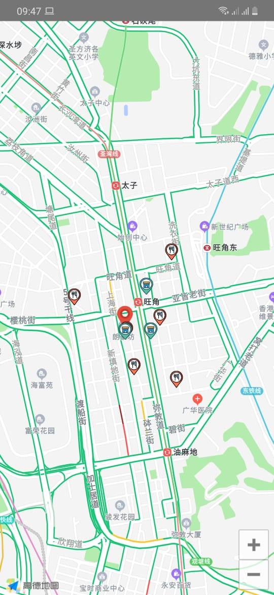

# React Native nearest location shop &amp; restaurant
Base on your current location find nearest shop and resturant locations.



## Related project recommendations:
* [React native amap geolocation](https://github.com/qiuxiang/react-native-amap-geolocation)
* [React-native-amap3d](https://www.npmjs.com/package/react-native-amap3d)
* [Geolib](https://www.npmjs.com/package/geolib)

## Add Gaode Key:
* Get key [High German Key](https://lbs.amap.com/api/android-sdk/guide/create-project/get-key)
* Add the following code in to `AndroidManifest.xml` file within `<application>`:
```xml
<meta-data  
 android:name = " com.amap.api.v2.apikey " 
 android:value = "Your High German Key "
/>
```

## Get current Location
Get current location and `setState` latitude & longitude

```JavaScript
    await PermissionsAndroid.requestMultiple([
      PermissionsAndroid.PERMISSIONS.ACCESS_FINE_LOCATION,
      PermissionsAndroid.PERMISSIONS.ACCESS_COARSE_LOCATION,
    ]);
 
    await init({
      android: "Your High German Key"
    });

    await Geolocation.getCurrentPosition(({ coords }) => {
      this.setState({
          latitude_ini:coords.latitude,
          longitude_ini:coords.longitude,
          region: {
                    latitude:coords.latitude,
                    longitude:coords.longitude,
                    latitudeDelta:0.0069,
                    longitudeDelta:0.0069,
                  },
      })
  });
```

## Calculate distance from 'gelib'
`ResturantData` data array filter with 500m distance

```JavaScript
  let {region } = this.state;
  let markersRest = this.state.ResturantData.filter(markerrest => {
      let distance = this.calculateLocDistance(region.latitude, region.longitude, markerrest.rest_latitude, markerrest.rest_longitude);
      return distance <= 500;
    });

  this.setState({
       ResturantData: markersRest,
    })
```
### Calculation from `geolib` code

```JavaScript
   calculateLocDistance(origingLat, origingLon, markerLocLat, markerLocLon) {
     return geolib.getDistance(
       {latitude: origingLat, longitude: origingLon},
       {latitude: markerLocLat, longitude: markerLocLon}
     );
   }
```


## Map View

```JavaScript
     <MapView 
        style={StyleSheet.absoluteFill}
        mapType={MapType.Bus}
        showsTraffic={this.state.showsTraffic}
        region={{
          latitude:this.state.latitude_ini,
          longitude:this.state.longitude_ini,
          latitudeDelta:0.0069,
          longitudeDelta:0.0069,
        }}
     >
```

## Resturant & Shop markers from array

```JavaScript
      {this.state.ResturantData.map(item => (
          <MapView.Marker
            title={"Name: " + item.rest_name}
            coordinate={{
              latitude:JSON.parse(item.rest_latitude),
              longitude:JSON.parse(item.rest_longitude),
            }}
            icon={() => (
            <View >
              <Image source={require('./img/foodlocation.png')} style={{height: 25, width:25 }} />
            </View>
          )}
          >
          </MapView.Marker>
            
       ))}
```
